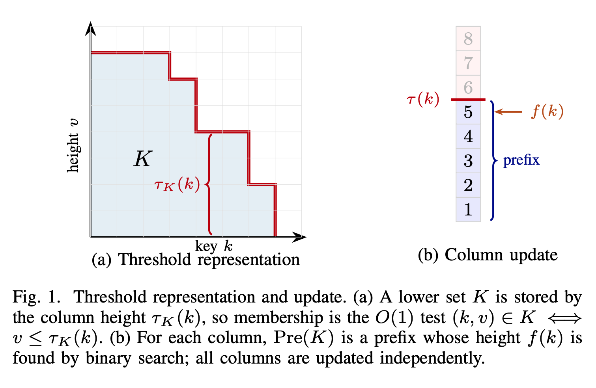
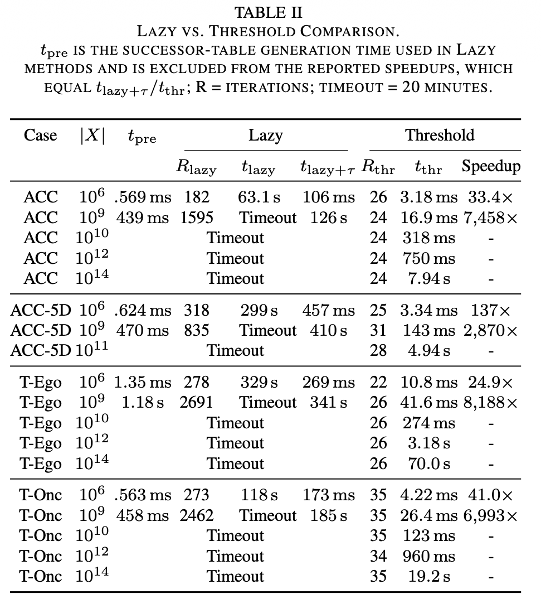

# pFaces-MonoSafe Threshold Experiments

**Real-time invariant-set synthesis for monotone systems.** This repository
contains the threshold-table and real-time controller experiments
behind the paper implementation.

The method stores one threshold height per grid column along
`threshold_d_star`, so safe-set membership is an `O(1)` lookup with
`O(N^(d-1))` storage instead of full-grid storage or basis scans.

The repository exposes four production solvers with one explicit configuration
key: literal CDC, Automatica with scan membership, Automatica with threshold
membership, and the proposed column-wise threshold GFP. Reference solvers are
kept separate from paper comparisons.

## Preview

<table>
  <tr>
    <td align="center">
      <b>ACC Basis Evolution</b><br/>
      <video src="./figures/acc_fine_basis_viridis_light.mp4" width="460" controls autoplay loop muted playsinline></video>
    </td>
    <td align="center">
      <b>ACC Threshold Evolution</b><br/>
      <video src="./figures/acc_fine_tt_viridis_light.mp4" width="460" controls autoplay loop muted playsinline></video>
    </td>
  </tr>
</table>

<p align="center">
  <b>Real-Time Left-Turn Controller</b><br/>
  <video src="./figures/intersection.mp4" width="760" controls autoplay loop muted playsinline></video>
</p>

## Method

 

 

## Setup

Install pFaces and expose both the CLI and SDK:

```bash
export PFACES_SDK_ROOT=/path/to/pfaces-sdk
export PATH=/path/to/pfaces/bin:$PATH
```

Ubuntu packages and Python environment:

```bash
sudo apt-get update
sudo apt-get install -y build-essential cmake git ocl-icd-opencl-dev clinfo \
    libnlopt-cxx-dev python3 python3-venv ffmpeg

python3 -m venv .venv
source .venv/bin/activate
pip install -U pip numpy pandas matplotlib
```

Build the pFaces kernel driver and list the GPU id used by the pFaces CLI:

```bash
sh build.sh
pfaces -G -l
```

## Unified End-To-End Runner

Run the complete pipeline (ACC basis video, ACC threshold video, and RT controller video) using one command:

```bash
./scripts/run_e2e.sh
```

Routing behavior:
- `macOS arm64` -> native run (downloads `pFaces-1.4-MacOS26-ARM64.4zip` into local cache).
- `Linux amd64` -> Docker run.
- Other host combinations fail fast with guidance.

You can still force Docker on macOS with `--mode docker`, but Docker runs Linux containers, so it uses the Linux pFaces asset (not the macOS `.4zip` asset). On Docker Desktop for macOS, GPU OpenCL passthrough is typically unavailable. In that case, ACC videos can run on CPU (`MONOSAFE_ACC_ONLY=1`) with a CL1.2 OpenCL override, while the RT controller stage remains GPU-only.

Optional flags:

```bash
./scripts/run_e2e.sh --mode auto
./scripts/run_e2e.sh --mode native
./scripts/run_e2e.sh --mode docker --output /path/to/output_dir
```

CPU ACC-only Docker run (no RT stage):

```bash
MONOSAFE_ACC_ONLY=1 PFACES_DEVICE_CLASS=C ./scripts/run_e2e.sh --mode docker
```

## Synthesis And Visualization

Run standalone threshold synthesis:

```bash
./run_threshold_synthesis.sh --cfg examples/acc/acc.cfg --mode threshold --device-class G --device 1
```

The script defaults to synthesis only. The immediate CDC schedule is selected by:

```bash
./run_threshold_synthesis.sh --cfg examples/acc/acc.cfg --mode cdc --device-class G --device 1
```

CPU execution is also supported for ACC synthesis:

```bash
./run_threshold_synthesis.sh \
    --cfg examples/acc/acc.cfg \
    --mode threshold \
    --device-class C \
    --device 1 \
    --opencl-opts "-cl-std=CL1.2"
```

For pure synthesis timing with no CSV/video output and no basis extraction:

```bash
./run_threshold_synthesis.sh \
    --cfg examples/turn_oncoming_first/turn_oncoming_first_threshold_rt.cfg \
    --device 1 \
    --timing-only
```

Grid resolution is controlled by `states.eta`; the designated threshold
dimension is controlled by `threshold_d_star` in the cfg file.

## Real-Time Controller

Run the two-oncoming real-time left-turn experiment:

```bash
./run_two_oncoming_threshold_rt.sh
```

The runner builds `tools/rt_controller/build_rt_threshold`, runs
`tools/rt_controller/examples/two_oncoming_threshold_rt.json`, writes logs and
metrics to `tools/rt_controller/experiments/...`, and generates plots plus
`intersection.mp4`.

Fast smoke runs:

```bash
./run_two_oncoming_threshold_rt.sh --no-build --no-plots
./run_two_oncoming_threshold_rt.sh --no-build --no-animate
```

The RT configs are data-driven. Edit `states.eta` and `threshold_d_star` in:

- `examples/turn_oncoming_first/turn_oncoming_first_threshold_rt.cfg`
- `examples/turn_ego_first/turn_ego_first_threshold_rt.cfg`
- `examples/two_oncoming/two_oncoming_threshold_rt.cfg`

The tracked paper/RT configurations explicitly select
`boundary_semantics=favorable_saturating`. The RT adapter selects
`synthesis_method=threshold` with inline dynamics at launch. On the verified RTX 5090
machine, the default 10.1B-cell phase tables stayed below 100 ms per online
synthesis.

## Bitmap GFP

Validate the explicit bitmap and CPU-threshold reference modes on ACC:

```bash
python3 tools/check_bitmap_gfp_acc.py
```

Benchmark ACC at large bitmap/threshold grids:

```bash
python3 tools/benchmark_bitmap_gfp_acc.py --sizes 1e8 1e9
```

Run the fair four-method benchmark (one warm-up and five measured runs):

```bash
python3 tools/run_four_method_benchmark.py --help
```

Add `--include-references` to record the bitmap and CPU-threshold reference
implementations under the same transition cache, repetitions, timing boundary,
and exact-output checks. They remain labeled reference-only in the summary.
`--experiment-config PATH` loads the method subset, state resolution, device,
warm-up count, measured-run count, timeout, and output directory from one JSON
file; see `tools/benchmark_configs/acc_large_poc.json`.

## Solver configuration

New or generated configurations select exactly one method:

```text
synthesis_method = "threshold";
transition_semantics = "extremal_single_successor";
transition_backend = "precomputed";
boundary_semantics = "favorable_saturating";
threshold_d_star = "-1";
```

Production values are `cdc`, `automatica_scan`, `automatica_threshold`, and
`threshold`. Reference-only values are `bitmap_reference` and
`threshold_cpu_reference`. Legacy `use_*` solver booleans are rejected rather
than translated implicitly. Benchmark and RT launchers generate or apply
explicit enum-based overrides. Fair four-way timing uses `precomputed` for every
method; `inline` is reserved for threshold RT/scalability runs and the bitmap
reference. The CPU-threshold reference requires precomputed successors.
`boundary_semantics=favorable_saturating` projects favorable per-axis exits to
the corresponding boundary and maps any unfavorable exit to the unsafe sink.
Use `strict_unsafe` only when every domain exit is intentionally unsafe.
